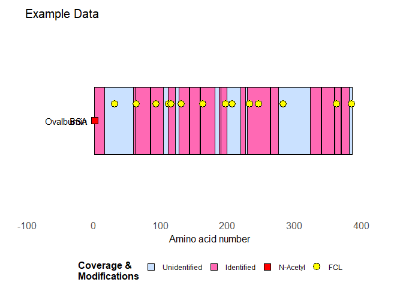

---


# Mascot Table

---

### <ins>**Contents**</ins>


- Introduction
- Guide
- Final Remarks
- Links

---

### <ins>**Introduction**</ins>

The routines in *mascotTable.R* are meant as a help to get the data from [mascot](https://www.matrixscience.com/) export csv files into usable protein (modification) tables. And obviously to be able to graphically display the experimental data with my own [drawProteins](https://github.com/DarkerThanEver/proteinDrawing) routines. The functions have not been tested beyond the data I encounter myself in work.

We use Mascot version 2.6.1 and data needs to be exported in *csv* format with the following fields present:

* protein sequence (prot_seq)
* peptide start (pep_start)
* peptide end (pep_end)

An example mascot export data file can be found in the example directory.
Note: some info has been masked by XXX.

Work in progress...

---

### <ins>**Guide**</ins>

The following R libraries & source filesare needed for the routines to work:

* stringr
* dplyr
* ggplot2
* R6
* [drawProteins](https://www.bioconductor.org/packages/release/bioc/html/drawProteins.html)
* [textData.R](https://github.com/DarkerThanEver/textData)
* [drawProteins.R](https://github.com/DarkerThanEver/proteinDrawing)

---


```r
# contains the experimentTable definitions
source("../proteinDrawing/proteinDrawing.R")
# contains the base class for dealing with text files
source("../textData/textData.R")

source("mascotTable.R")
```

To get some general info on the mascot files, without having to immediately create an object, you can use some of the routines in an anonymous manner:


```r
kable(mascotFile$new("example/mascot_example.csv")$getTable(whichTable = "Header", header = FALSE))
```


|variable                        |value                                                                           |
|:-------------------------------|:-------------------------------------------------------------------------------|
|Search title                    |                                                                                |
|Timestamp                       |20XX-XX-XXT13:11:38Z                                                            |
|User                            |                                                                                |
|Email                           |                                                                                |
|Report URI                      |http://XXXXXXXXX/mascot/cgi/master_results.pl?file=../data/XXXXXXXX/FXXXXXX.dat |
|Peak list data path             |wkl-005-corrected.mgf                                                           |
|Peak list format                |Mascot generic                                                                  |
|Search type                     |MIS                                                                             |
|Mascot version                  |2.6.1                                                                           |
|Database                        |1::3P 2::Swiss-Prot-XXXXX.All                                                   |
|Fasta file                      |1::3P_XXXXXX.fasta 2::Swiss-Prot-XXXXX.fasta                                    |
|Total sequences                 |561572                                                                          |
|Total residues                  |201999380                                                                       |
|Sequences after taxonomy filter |561572                                                                          |
|Number of queries               |8540                                                                            |

To know which tables are present in the mascot file (this can vary from file to file):


```r
mascotFile$new("example/mascot_example.csv")$getTableNames()
```

```
## [1] "Header"                 "Decoy"                  "Variable modifications"
## [4] "Search Parameters"      "Format parameters"      "Protein hits"
```
Of course you can also create an object and read these infos:


```r
mascot1 <- mascotFile$new("example/mascot_example.csv")
mascot1$getTableNames()
```

```
## [1] "Header"                 "Decoy"                  "Variable modifications"
## [4] "Search Parameters"      "Format parameters"      "Protein hits"
```

Sometimes a certain table has a bit more info than just a variable/value pair. In these cases *header = TRUE* may help, eg the *Variable modifications* table has a bit more info:


```r
kable(mascotFile$new("example/mascot_example.csv")$getTable(whichTable = "Variable modifications", header = TRUE))
```


|Identifier |Name                    |Delta      |Neutral loss(es) |
|:----------|:-----------------------|:----------|:----------------|
|1          |Acetyl (Protein N-term) |42.010565  |                 |
|2          |XXX (K)                 |378.131468 |                 |
|3          |XXXC (C)                |378.131468 |                 |
|4          |XXXN (Protein N-term)   |378.131468 |                 |
|5          |Phospho (ST)            |79.966331  |0,97.976896      |
|6          |Phospho (Y)             |79.966331  |                 |
|7          |Carbamidomethyl (C)     |57.021464  |                 |
You can also simply extract the text lines of the table if for some reason it doesn't come out properly with *getTable()*:


```r
mascotFile$new("example/mascot_example.csv")$getTableLines(whichTable = "Variable modifications")
```

```
## [1] "\"Identifier\",\"Name\",\"Delta\",\"Neutral loss(es)\""
## [2] "1,\"Acetyl (Protein N-term)\",42.010565"               
## [3] "2,\"XXX (K)\",378.131468"                              
## [4] "3,\"XXXC (C)\",378.131468"                             
## [5] "4,\"XXXN (Protein N-term)\",378.131468"                
## [6] "5,\"Phospho (ST)\",79.966331,0,97.976896"              
## [7] "6,\"Phospho (Y)\",79.966331"                           
## [8] "7,\"Carbamidomethyl (C)\",57.021464"
```

The *Protein hits* table is the only table you can't properly get out with *getTable()*. You can use *getTableLines()*, but to get a proper table you need to use *readRaw()* (or *read.csv* obviously).

Note: the arguments *skip* and *indicator* are there for when the internal procedures don't work properly for whatever reason or should *Matrix Science* decides to change the format.


```r
mascot1 <- mascotFile$new("example/mascot_example.csv")$readRaw(skip = NA, indicator = "Protein hits")
colnames(mascot1)
```

```
##  [1] "prot_hit_num"       "prot_family_member" "prot_acc"          
##  [4] "prot_desc"          "prot_score"         "prot_mass"         
##  [7] "prot_matches"       "prot_matches_sig"   "prot_sequences"    
## [10] "prot_sequences_sig" "prot_seq"           "pep_query"         
## [13] "pep_rank"           "pep_isbold"         "pep_isunique"      
## [16] "pep_exp_mz"         "pep_exp_mr"         "pep_exp_z"         
## [19] "pep_calc_mr"        "pep_delta"          "pep_start"         
## [22] "pep_end"            "pep_miss"           "pep_score"         
## [25] "pep_expect"         "pep_res_before"     "pep_seq"           
## [28] "pep_res_after"      "pep_var_mod"        "pep_var_mod_pos"   
## [31] "pep_summed_mod_pos" "pep_local_mod_pos"  "pep_scan_title"
```

```r
nrow(mascot1)
```

```
## [1] 942
```
If needed you can modify this table any way as is normally done in R.

There are two ways to get the identified proteins from the mascot file:

* function *proteinsInFile()*
* querying the table generated by *readRaw()*

Note: as with most functions in *mascotFile* objects you essentially do the same either way. It's just that *proteinsInFile()* removes the table from memory afterwards.

Using *proteinsInFile()*:


```r
mascot1 <- mascotFile$new("example/mascot_example.csv")$proteinsInFile()
head(mascot1)
```

```
## [1] "1::OVAL_CHICK"         "2::P19104|OVAL_COTJA"  "2::P01014|OVALY_CHICK"
## [4] "2::O73860|OVAL_MELGA"  "2::Q6V115|OVAL_COTCO"  "2::A5IM97|RS8_THEP1"
```

Using the table generated by *readRaw()*:


```r
mascot1 <- mascotFile$new("example/mascot_example.csv")
mascot2 <- mascot1$readRaw()
head(unique(mascot2$prot_acc))
```

```
## [1] "1::OVAL_CHICK"         "2::P19104|OVAL_COTJA"  "2::P01014|OVALY_CHICK"
## [4] "2::O73860|OVAL_MELGA"  "2::Q6V115|OVAL_COTCO"  "2::A5IM97|RS8_THEP1"
```

To create actual an *experimentTable* as used by *drawProteins*, the output of *readRaw()* can be fed into the (non-object) function *mascotExperimentTable()*


```r
mascot1 <- mascotFile$new("example/mascot_example.csv")
mascot2 <- mascot1$readRaw()
firstProtein <- unique(mascot2$prot_acc)[1]
mascotExp <- mascotExperimentTable(proteinData = mascot2, whichProtein = firstProtein, order = 1, addFixedMods = NA,
                                   varModTable = mascot1$getVarModTable(), minimumExpect = 0.05)
# leave out first row as it contains the protein amino acid sequence which can be a quite long string of characters
kable(mascotExp[-1,], row.names = FALSE)
```


|type    |description             | begin| end| length| order|sequence                            |mods                                         |     expMr|    calcMr|       rt|  expect|varModPos                      |
|:-------|:-----------------------|-----:|---:|------:|-----:|:-----------------------------------|:--------------------------------------------|---------:|---------:|--------:|-------:|:------------------------------|
|COVER   |1::OVAL_CHICK           |     1|  17|     16|     1|GSIGAASMEFCFDVFK                    |                                             | 1707.7623| 1707.7637| 48.07607| 6.3e-06|                               |
|COVER   |1::OVAL_CHICK           |     1|  17|     16|     1|GSIGAASMEFCFDVFK                    |Acetyl (Protein N-term)                      | 1749.7728| 1749.7742| 55.28743| 0.0e+00|1.0000000000000000.0           |
|COVER   |1::OVAL_CHICK           |     1|  17|     16|     1|GSIGAASMEFCFDVFK                    |Carbamidomethyl (C)                          | 1764.7823| 1764.7851| 44.28893| 1.2e-05|0.0000000000700000.0           |
|COVER   |1::OVAL_CHICK           |     1|  17|     16|     1|GSIGAASMEFCFDVFK                    |Acetyl (Protein N-term); Carbamidomethyl (C) | 1806.7936| 1806.7957| 49.03307| 0.0e+00|1.0000000000700000.0           |
|COVER   |1::OVAL_CHICK           |    59|  85|     26|     1|FDKLPGFGDSIEAQCGTSVNVHSSLR          |Carbamidomethyl (C)                          | 2820.3494| 2820.3501| 33.45902| 2.5e-02|0.00000000000000700000000000.0 |
|COVER   |1::OVAL_CHICK           |    59|  85|     26|     1|FDKLPGFGDSIEAQCGTSVNVHSSLR          |Phospho (ST); Carbamidomethyl (C)            | 2900.3162| 2900.3164| 34.34535| 8.7e-04|0.00000000050000700000000000.0 |
|COVER   |1::OVAL_CHICK           |    62|  85|     23|     1|LPGFGDSIEAQCGTSVNVHSSLR             |                                             | 2373.1381| 2373.1383| 34.31037| 1.2e-04|                               |
|COVER   |1::OVAL_CHICK           |    62|  85|     23|     1|LPGFGDSIEAQCGTSVNVHSSLR             |Carbamidomethyl (C)                          | 2430.1605| 2430.1598| 32.31022| 9.5e-03|0.00000000000700000000000.0    |
|COVER   |1::OVAL_CHICK           |    62|  85|     23|     1|LPGFGDSIEAQCGTSVNVHSSLR             |Phospho (ST); Carbamidomethyl (C)            | 2510.1258| 2510.1261| 32.97218| 3.0e-03|0.00000050000700000000000.0    |
|COVER   |1::OVAL_CHICK           |    85| 105|     20|     1|DILNQITKPNDVYSFSLASR                |                                             | 2280.1712| 2280.1750| 40.28992| 5.8e-04|                               |
|COVER   |1::OVAL_CHICK           |   105| 111|      6|     1|LYAEER                              |                                             |  779.3830|  779.3813| 12.16358| 4.9e-02|                               |
|COVER   |1::OVAL_CHICK           |   111| 123|     12|     1|YPILPEYLQCVK                        |                                             | 1464.7656| 1464.7686| 40.60038| 2.0e-02|                               |
|COVER   |1::OVAL_CHICK           |   111| 123|     12|     1|YPILPEYLQCVK                        |Carbamidomethyl (C)                          | 1521.7878| 1521.7901| 38.43138| 8.8e-03|0.000000000700.0               |
|COVER   |1::OVAL_CHICK           |   127| 143|     16|     1|GGLEPINFQTAADQAR                    |                                             | 1686.8313| 1686.8325| 32.21550| 4.9e-04|                               |
|COVER   |1::OVAL_CHICK           |   143| 159|     16|     1|ELINSWVESQTNGIIR                    |                                             | 1857.9556| 1857.9585| 37.80592| 4.1e-03|                               |
|COVER   |1::OVAL_CHICK           |   159| 182|     23|     1|NVLQPSSVDSQTAMVLVNAIVFK             |                                             | 2459.3082| 2459.3094| 51.46733| 6.1e-03|                               |
|COVER   |1::OVAL_CHICK           |   182| 187|      5|     1|GLWEK                               |                                             |  631.3319|  631.3329| 18.60328| 4.7e-02|                               |
|COVER   |1::OVAL_CHICK           |   187| 200|     13|     1|AFKDEDTQAMPFR                       |                                             | 1554.7114| 1554.7137| 25.45537| 2.4e-04|                               |
|COVER   |1::OVAL_CHICK           |   190| 200|     10|     1|DEDTQAMPFR                          |                                             | 1208.5123| 1208.5132| 24.16003| 6.6e-04|                               |
|COVER   |1::OVAL_CHICK           |   219| 227|      8|     1|VASMASEK                            |                                             |  821.3941|  821.3953|  9.97690| 4.7e-03|                               |
|COVER   |1::OVAL_CHICK           |   229| 264|     35|     1|ILELPFASGTMSMLVLLPDEVSGLEQLESIINFEK |                                             | 3861.9964| 3862.0035| 68.03565| 2.2e-04|                               |
|COVER   |1::OVAL_CHICK           |   264| 277|     13|     1|LTEWTSSNVMEER                       |                                             | 1580.7132| 1580.7141| 27.58112| 4.6e-05|                               |
|COVER   |1::OVAL_CHICK           |   280| 285|      5|     1|VYLPR                               |                                             |  646.3806|  646.3802| 19.76220| 3.7e-02|                               |
|COVER   |1::OVAL_CHICK           |   323| 340|     17|     1|ISQAVHAAHAEINEAGR                   |                                             | 1772.8917| 1772.8918| 17.68203| 5.0e-04|                               |
|COVER   |1::OVAL_CHICK           |   340| 360|     20|     1|EVVGSAEAGVDAASVSEEFR                |                                             | 2007.9393| 2007.9385| 31.83522| 1.6e-05|                               |
|COVER   |1::OVAL_CHICK           |   340| 360|     20|     1|EVVGSAEAGVDAASVSEEFR                |Phospho (ST)                                 | 2087.9026| 2087.9048| 32.79560| 0.0e+00|0.00005000000000000000.0       |
|COVER   |1::OVAL_CHICK           |   360| 370|     10|     1|ADHPFLFCIK                          |                                             | 1189.5936| 1189.5954| 35.93688| 1.6e-03|                               |
|COVER   |1::OVAL_CHICK           |   360| 370|     10|     1|ADHPFLFCIK                          |Carbamidomethyl (C)                          | 1246.6156| 1246.6169| 34.02980| 3.7e-02|0.0000000700.0                 |
|COVER   |1::OVAL_CHICK           |   370| 382|     12|     1|HIATNAVLFFGR                        |                                             | 1344.7288| 1344.7303| 34.51040| 1.2e-05|                               |
|MOD_RES |Acetyl (Protein N-term) |     1|   1|      1|     1|NA                                  |NA                                           |        NA|        NA|       NA|      NA|NA                             |
|MOD_RES |Carbamidomethyl (C)     |    11|  11|      1|     1|NA                                  |NA                                           |        NA|        NA|       NA|      NA|NA                             |
|MOD_RES |Carbamidomethyl (C)     |    73|  73|      1|     1|NA                                  |NA                                           |        NA|        NA|       NA|      NA|NA                             |
|MOD_RES |Phospho (ST)            |    68|  68|      1|     1|NA                                  |NA                                           |        NA|        NA|       NA|      NA|NA                             |
|MOD_RES |Carbamidomethyl (C)     |   120| 120|      1|     1|NA                                  |NA                                           |        NA|        NA|       NA|      NA|NA                             |
|MOD_RES |Phospho (ST)            |   344| 344|      1|     1|NA                                  |NA                                           |        NA|        NA|       NA|      NA|NA                             |
|MOD_RES |Carbamidomethyl (C)     |   367| 367|      1|     1|NA                                  |NA                                           |        NA|        NA|       NA|      NA|NA                             |

A table with only the modifications:


```r
kable(mascotExp[-1,] %>% filter(type == "MOD_RES")  %>% select(description, begin, end, length), row.names = FALSE)
```


|description             | begin| end| length|
|:-----------------------|-----:|---:|------:|
|Acetyl (Protein N-term) |     1|   1|      1|
|Carbamidomethyl (C)     |    11|  11|      1|
|Carbamidomethyl (C)     |    73|  73|      1|
|Phospho (ST)            |    68|  68|      1|
|Carbamidomethyl (C)     |   120| 120|      1|
|Phospho (ST)            |   344| 344|      1|
|Carbamidomethyl (C)     |   367| 367|      1|

Information concerning the fixed modifications is actually not present in the table generated by *readRaw()*, but those can be added manually via the *addFixedMods* argument. It should be a *data.frame* with the following structure:


```r
kable(addFixedModsCM)
```


|aa |mod             |
|:--|:---------------|
|C  |Carbamidomethyl |

The *data.frame* can be any number of rows. Note that if a fixed modification is present on more than one type of amino acid, every amino acid needs to be specified on a separate row of its own.

Note: by definition it generates all positions in the *protein chain*, it doesn't take coverage into account!

Example:


```r
addFixedModsEX <- data.frame(aa = c("Q","P"),mod = c("Eazy","FCL"), stringsAsFactors = FALSE)
mascotExp <- mascot1$experimentTable(whichProtein = firstProtein, addFixedMods = addFixedModsEX)
kable(mascotExp[-1,] %>% filter(type == "MOD_RES")  %>% select(description, begin, end, length), row.names = FALSE)
```


|description             | begin| end| length|
|:-----------------------|-----:|---:|------:|
|Eazy                    |    52|  52|      1|
|Eazy                    |    72|  72|      1|
|Eazy                    |    89|  89|      1|
|Eazy                    |   119| 119|      1|
|Eazy                    |   135| 135|      1|
|Eazy                    |   140| 140|      1|
|Eazy                    |   152| 152|      1|
|Eazy                    |   162| 162|      1|
|Eazy                    |   169| 169|      1|
|Eazy                    |   194| 194|      1|
|Eazy                    |   203| 203|      1|
|Eazy                    |   209| 209|      1|
|Eazy                    |   213| 213|      1|
|Eazy                    |   254| 254|      1|
|Eazy                    |   325| 325|      1|
|FCL                     |    31|  31|      1|
|FCL                     |    63|  63|      1|
|FCL                     |    93|  93|      1|
|FCL                     |   112| 112|      1|
|FCL                     |   115| 115|      1|
|FCL                     |   131| 131|      1|
|FCL                     |   163| 163|      1|
|FCL                     |   197| 197|      1|
|FCL                     |   207| 207|      1|
|FCL                     |   233| 233|      1|
|FCL                     |   246| 246|      1|
|FCL                     |   283| 283|      1|
|FCL                     |   363| 363|      1|
|FCL                     |   385| 385|      1|
|Acetyl (Protein N-term) |     1|   1|      1|
|Carbamidomethyl (C)     |    11|  11|      1|
|Carbamidomethyl (C)     |    73|  73|      1|
|Phospho (ST)            |    68|  68|      1|
|Carbamidomethyl (C)     |   120| 120|      1|
|Phospho (ST)            |   344| 344|      1|
|Carbamidomethyl (C)     |   367| 367|      1|

Of course the mascotExperimentTable output can be used for protein chain drawing:


```r
ovalbumin_digest <- experimentChain$new()$addTable(mascotExp, order = 1)

theLegend <- data.frame(labels = c("Unidentified","Identified","N-Acetyl","FCL"),
                        colors = "black",
                        fills = c("lightsteelblue1","hotpink","red","yellow"),
                        shapes = c(22,22,22,21), sizes = 4)

p <- ovalbumin_digest$draw_canvas() %>%
  ovalbumin_digest$draw_chains(fill = "lightsteelblue1", labels = c("Ovalbumin","BSA")) %>%
  ovalbumin_digest$draw_coverage(color = "black", fill = "hotpink") %>%

  ovalbumin_digest$draw_mods(modification =  "Acetyl",outsideCoverage = FALSE, shape = 22,
                             size = 4, color = "black", fill = "red", inOut = 0.0) %>%
  ovalbumin_digest$draw_mods(modification =  "FCL",outsideCoverage = TRUE, shape = 21,
                             size = 4, color = "black", fill = "yellow", inOut = 0.1) +
  labs(title = "Example Data") +
  theme_bw(base_size = 20) +
  theme(plot.title = element_text(size = 15)) +
  theme(axis.text = element_text(size = 12)) +
  theme(axis.title = element_text(size = 12)) +
  theme(panel.grid.minor=element_blank(), 
        panel.grid.major=element_blank()) +
  theme(axis.ticks = element_blank(), 
        axis.text.y = element_blank()) +
  theme(panel.border = element_blank())

p <- customLegend(p, legend = theLegend, legend.title = "Coverage &\nModifications",
                  legend.position = "bottom", legend.element.size = 9)
p
```

<!-- -->

Note: by setting *outsideCoverage* to *FALSE* you will get no modifications drawn if they're not inside the *coverage* (identified parts of the protein chain).

---

### <ins>**Final remarks**</ins>

This code allows semi-automated processing of mascot search reseults. Together with [proteinDrawing](https://github.com/DarkerThanEver/proteinDrawing) it allows graphical representation of these results. For my own work I wanted to be able to easily make tables without having to use the error prone copy-paste method. The drawing of protein chains was merely an extension of this to be able to present my data to colleagues etc. A picture is often quicker/easier to interpret than a table.

The code has not been exhaustively tested, but has worked consistently good (needing only minor tweaks) for some time now in my own work. I give no guarantees however: use it at your own risk!

I'm always open to suggestions & comments: [Ben Bruyneel](mailto:bruyneel.ben@gmail.com)

To be continued...


---

### <ins>**Links**</ins>
**Github**

[mascotTable repository](https://github.com/DarkerThanEver/mascotTable)

[proteinDrawing repository](https://github.com/DarkerThanEver/proteinDrawing)

[textData repository](https://github.com/DarkerThanEver/textData)

**R package drawProteins**

[User guide](https://www.bioconductor.org/packages/release/bioc/vignettes/drawProteins/inst/doc/drawProteins_BiocStyle.html)

[Bioconductor](https://www.bioconductor.org/packages/release/bioc/html/drawProteins.html)

[Github Repository](https://github.com/brennanpincardiff/drawProteins)

**R & RStudio**

[R (programming language)](https://www.r-project.org/)

[R Studio (IDE for R)](https://www.rstudio.com/) 

**Proteomics information & software**

[proteomics](https://en.wikipedia.org/wiki/Proteomics)

[Mascot](https://www.matrixscience.com/)

---
